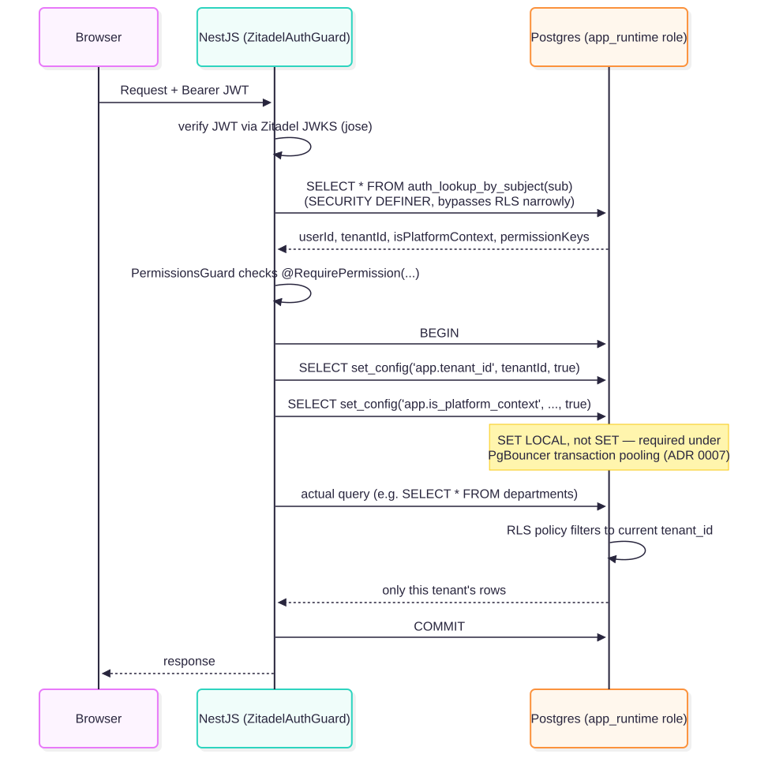

# Architecture Overview

This is the map of the whole system. If you're new, read this first, then
`docs/onboarding/GETTING_STARTED.md` to actually run it.

## What this platform is

A multi-tenant, white-labelable SaaS ERP. One deployment serves many client organisations
("tenants" — e.g. Sachhi Saheli). Each tenant gets its own users, roles, branding, and
completely isolated data, enforced at the database layer, not just in application code.

## System diagram

- **apps/web** — React + Vite frontend. Tenant Admin panel and Super Admin (platform) panel in
  one app, route-gated by permission.
- **apps/api** — NestJS backend, a modular monolith (not microservices — see ADR 0006's sibling
  reasoning on avoiding premature distribution).
- **PostgreSQL 17**, behind **PgBouncer** — the source of truth for every business entity
  (tenants, users, roles, and everything HR/Finance/Projects/CRM add in later phases).
- **MongoDB** — audit/activity log only. See ADR 0005 for why it's scoped this narrowly.
- **Valkey** — job queue (BullMQ) and caching. See ADR 0004 for why it's Valkey, not Redis.
- **MinIO** — object storage for uploaded documents, evidence, payslips.
- **Zitadel** — authentication (login, MFA, OIDC). See ADR 0002.
- **OpenTelemetry → Grafana stack** (Tempo/Loki/Prometheus/Grafana) — traces, logs, metrics.

## Multi-tenancy: how isolation actually works

Every tenant-scoped table has a `tenant_id` column and a Postgres Row-Level Security policy.
Isolation is enforced by the **database**, not by remembering to add `WHERE tenant_id = ...` in
every query. Full reasoning: ADR 0001. The PgBouncer + `SET LOCAL` mechanics that make this work
under connection pooling: ADR 0007.

## Authentication vs authorization

**Zitadel answers "who is this?" Postgres answers "what can they do?"** These are deliberately
two different systems — see ADR 0002 and ADR 0003 for why.

## Role model

Four roles are fixed and can never be renamed or deleted: `super_admin`, `developer`,
`maintainer` (platform-level, cross-tenant) and `admin` (one per tenant, the org owner, seeded
automatically when a tenant is created). Every other role — HR, Finance, Field Staff, whatever a
tenant needs — is custom, built by that tenant's `admin` from a fixed permission catalog
(`packages/permissions`) via the Role Builder (`apps/web/src/routes/AdminRolesPage.tsx`).

## What's actually implemented right now

This is **Phase 0 (infra/scaffold) + Phase 1 (Foundation & Admin)** only:

- Tenant provisioning, Super Admin panel (list/create/suspend tenants)
- Organisation profile + theming (white-label colors/logo)
- Departments, Designations
- Role Builder (custom roles from the permission catalog)
- User invite → first-login claim flow
- Full RLS + RBAC enforcement, proven end-to-end (see verification notes below)

**Not yet built**: HR Core (employee/volunteer master, attendance, leave — Phase 2), HR Payroll
(Phase 3), Finance, Projects, CRM (Phases 4–6). See the client-facing
`docs/deliverables/Sachhi_Saheli_ERP_Phased_Delivery_Plan.docx` for that phase breakdown — this
document is about the platform's technical architecture, that one is about the product roadmap.

## Decisions, in full

See `docs/adr/` for the complete reasoning behind every choice above:

| ADR | Decision |
|---|---|
| [0001](../adr/0001-multi-tenancy-shared-schema-rls.md) | Shared schema + Postgres RLS for multi-tenancy |
| [0002](../adr/0002-zitadel-for-authn.md) | Zitadel for authentication |
| [0003](../adr/0003-postgres-rbac-for-authz.md) | Postgres tables (not Zitadel) for authorization |
| [0004](../adr/0004-valkey-over-redis.md) | Valkey instead of Redis |
| [0005](../adr/0005-mongo-scoped-to-audit-log.md) | MongoDB scoped to audit log only |
| [0006](../adr/0006-no-go-python-in-v1.md) | No Go/Python in v1 |
| [0007](../adr/0007-pgbouncer-transaction-pooling-and-set-local.md) | PgBouncer transaction pooling + `SET LOCAL` |
| [0008](../adr/0008-theming-css-variables.md) | Per-tenant theming via CSS variables |

## Verified end-to-end (this pass)

- `docker compose up` brings up Postgres/PgBouncer/Mongo/Valkey/MinIO/Zitadel/OTel/Grafana cleanly
- Prisma migrations apply, including RLS policies and the `auth_lookup_by_subject`/`claim_invite`
  SQL functions
- RLS proven directly against Postgres: a platform-context insert succeeds, a tenant sees its own
  row, a different tenant sees zero rows
- `apps/api` builds and boots against the real database; guarded routes correctly return 401
  without a token
- `apps/web` builds cleanly (`tsc --noEmit && vite build`)
- `turbo run build` succeeds across the whole monorepo

## Not yet done (honest gaps)

- The full `docker compose up` stack (all 11 services: Postgres, PgBouncer, Mongo, Valkey, MinIO,
  Zitadel, OTel Collector, Tempo, Loki, Prometheus, Grafana) has been brought up and verified —
  every service responds over HTTP (`/health`, `/-/healthy`, etc.), not just "container running."
  Two config bugs were found and fixed in the process: the OTel Collector's `loki` log exporter
  doesn't exist in current collector-contrib builds (switched to `otlphttp` against Loki's native
  OTLP endpoint), and Tempo's config schema moved the retention block (simplified to defaults).
- Creating the actual Zitadel OIDC application/project is still a **manual one-time step** — see
  GETTING_STARTED.md step 4. So the login flow is implemented and Zitadel is running, but not yet
  exercised end-to-end against a real login.
- Mongo/Valkey/MinIO are live in infra and have env vars wired in `apps/api/.env.example`, but no
  application code uses them yet — there's no Phase 0/1 feature that needs a job queue, cache, or
  file upload. They're ready for Phase 2+.
