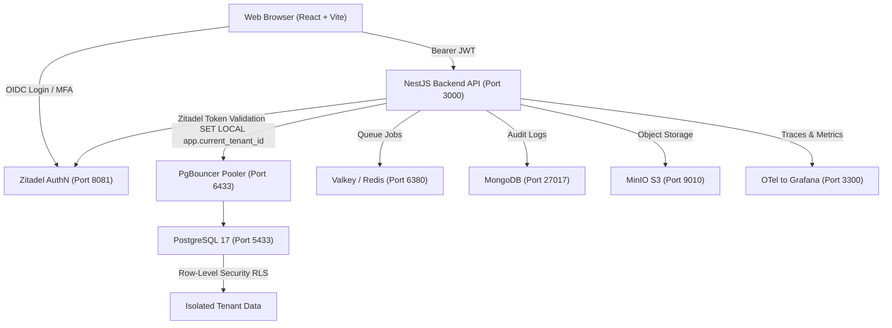

# Phase 1: Foundation & Admin — Complete Deliverable Document

**Project**: Multi-Tenant White-Labelable SaaS ERP  
**Client / Pilot Tenant**: Sachhi Saheli (NGO)  
**Milestone**: Phase 1 (Foundation & Admin Module)  
**Status**: COMPLETED & VERIFIED  
**Date**: September 26, 2026  

---

## 1. Executive Summary

Phase 1 provides the core foundational multi-tenant infrastructure, administrative control plane, authentication, and role-based access control (RBAC) required to support all subsequent ERP modules (HR Core, Payroll, Finance, Projects, CRM).

This document serves as the formal record of all technical components, features, database schemas, APIs, UI pages, and security controls delivered and verified in Phase 1 prior to transitioning to Phase 2 (HR Core).

---

## 2. High-Level Architecture Delivered



### Core Architecture Highlights
1. **Multi-Tenancy via PostgreSQL Row-Level Security (RLS)**:
   - Shared schema architecture where every tenant-scoped table enforces `tenant_id` at the database engine level.
   - Transaction-scoped tenant isolation via `SET LOCAL app.current_tenant_id = '<tenant_id>'` inside PgBouncer transaction pooling.
2. **Separation of Authentication (AuthN) & Authorization (AuthZ)**:
   - **AuthN (Zitadel)**: Proves identity via OIDC/JWT, passwordless/MFA, and user claim flows.
   - **AuthZ (PostgreSQL RBAC)**: Decides permissions, custom roles, and tenant boundaries within Postgres.
3. **HeroUI Aesthetic Frontend**:
   - Monorepo package (`apps/web`) built with React 18, Vite, Tailwind CSS, and custom HeroUI-styled components (rounded-2xl cards, fluid buttons, avatars, status badges, toast feedback, and light/dark theme switcher).

---

## 3. Detailed Component Deliverables

### A. Infrastructure & Container Services (`infra/docker-compose.yml`)

| Service | Technology | Port | Purpose / Delivered Functionality |
|---|---|---|---|
| **Database** | PostgreSQL 17 | `5433` (direct) | Relational data store with native RLS policies. |
| **Connection Pooler** | PgBouncer | `6433` (pooled) | Transaction-mode pooling supporting `SET LOCAL` tenant context. |
| **Identity / Auth** | Zitadel v2 | `8081` | OIDC provider, login console, token issuer, and user store. |
| **Local SMTP** | Mailpit | `8025` / `1025` | Intercepts invite and claiming emails for local dev/demo. |
| **Job Queue** | Valkey | `6380` | High-performance Redis-compatible BullMQ runner. |
| **Audit Logs** | MongoDB 7 | `27017` | Append-only document store for administrative and security audit trails. |
| **Object Store** | MinIO | `9010` / `9011` | S3-compatible storage for logos, assets, and document uploads. |
| **Observability** | Grafana Stack | `3300` / `3100` / `3200` | Prometheus metrics, Tempo traces, Loki logs, and Grafana dashboards. |

---

### B. Database Schema & Row-Level Security (`apps/api/prisma/schema.prisma`)

#### 1. Core Models Delivered
- `Tenant`: Multi-tenant organization container (slug, name, suspended status, branding JSON, timestamps).
- `User`: Tenant-scoped user profiles with `zitadelSubjectId` linkage, department/designation foreign keys, and soft deactivation.
- `Role`: Tenant-scoped custom roles, plus protected seeded tenant owner role (`admin`).
- `RolePermission`: Mapping table linking roles to fixed permission keys.
- `UserRole`: Many-to-many relationship assigning users to roles.
- `Department`: Tenant-scoped organizational department master.
- `Designation`: Tenant-scoped job title / designation master.

#### 2. PostgreSQL Security Functions & RLS Policies
- **`auth_lookup_by_subject(p_subject)`**: `SECURITY DEFINER` function resolving user ID, tenant ID, platform status, and permission keys during Zitadel token verification.
- **`claim_invite(p_subject, p_email)`**: `SECURITY DEFINER` function binding an unlinked Zitadel subject to an invited user profile via verified email.
- **RLS Policies**: Enforced on `users`, `departments`, `designations`, `roles`, `role_permissions`, and `user_roles`. Blocks cross-tenant reads and writes unconditionally at the database level.

---

### C. Permissions Catalog & RBAC (`packages/permissions`)

The permission catalog is fixed and centralized. Tenant Admins can create and edit custom roles using only predefined permission keys:

```
Platform Permissions (Cross-Tenant):
├── platform.tenant.read          (View any tenant)
├── platform.tenant.write         (Create/edit any tenant)
├── platform.tenant.suspend       (Suspend/reinstate any tenant)
└── platform.tenant.impersonate   (Support login as user)

Tenant Admin Permissions (Phase 1):
├── admin.org.read                (View organisation profile)
├── admin.org.write               (Edit branding, logo, colors)
├── admin.department.read/write/delete
├── admin.designation.read/write/delete
├── admin.role.read/write/delete  (Role Builder)
└── admin.user.read/invite/write/deactivate
```

---

### D. NestJS Backend API (`apps/api`)

#### 1. Controllers & Endpoints Delivered

| Controller | Route | Method | Description |
|---|---|---|---|
| **Health** | `/health` | `GET` | System liveness probe returning status and timestamp. |
| **Auth** | `/auth/me` | `GET` | Resolves authenticated user identity, roles, and permissions. |
| **Auth** | `/auth/claim-invite` | `POST` | Links Zitadel JWT subject to pre-created user profile. |
| **Platform** | `/platform/tenants` | `GET`, `POST` | List and provision new tenants (with automatic seeded admin role). |
| **Platform** | `/platform/tenants/:id/suspend` | `PATCH` | Suspend tenant access immediately. |
| **Platform** | `/platform/tenants/:id/reinstate` | `PATCH` | Reinstate suspended tenant. |
| **Platform** | `/platform/tenants/:id/invite-owner` | `POST` | Invite initial organization owner. |
| **Org** | `/admin/org` | `GET`, `PATCH` | Fetch and update organisation profile & theme JSON. |
| **Departments** | `/admin/departments` | `GET`, `POST`, `DELETE` | CRUD for tenant departments (with P2002 conflict handling). |
| **Designations** | `/admin/designations` | `GET`, `POST`, `DELETE` | CRUD for tenant designations (with P2002 conflict handling). |
| **Roles** | `/admin/roles` | `GET`, `POST`, `PATCH`, `DELETE` | Role Builder for custom roles with permission arrays. |
| **Users** | `/admin/users` | `GET`, `POST` | List members and invite new users with assigned roles. |
| **Users** | `/admin/users/:id/deactivate` | `PATCH` | Soft-deactivate a member's access. |

#### 2. Guards & Security Middleware
- `ZitadelAuthGuard`: Validates bearer tokens against Zitadel JWKS and populates `request.authContext`.
- `@RequirePermission(...keys)`: Decorator and guard enforcing granular RBAC before controller execution.
- Standardized HTTP Exception Filters: Maps Prisma unique constraint (`P2002`) and record not found (`P2025`) errors to client-friendly `ConflictException` and `NotFoundException`.

---

### E. React Frontend Web Application (`apps/web`)

#### 1. HeroUI Design System Components Delivered (`src/components/ui/`)
- **Avatar & User**: Bordered rings, status indicators (`online`, `busy`, `away`, `offline`), deterministic avatar gradients from name hashes, and compound `<User>` component.
- **Button**: Curved borders (`rounded-xl`), micro-interaction active scale (`active:scale-[0.97]`), variants (`primary`, `secondary`, `destructive`, `ghost`, `flat`).
- **Card**: Rounded-2xl layout, subtle borders, high-contrast surface in both light and dark modes.
- **Input & Form Controls**: Rounded-xl, focus rings, accessible labels.
- **Table**: Clean, padded data grids with hoverable rows and action buttons.
- **Confirm Modal (`useConfirm`)**: 100% opaque card, high-contrast buttons, smooth backdrop blur overlay (`bg-black/60 backdrop-blur-md`), and <kbd>Esc</kbd> key dismissal.
- **Toast Notifications (`toast.*`)**: Floating glassmorphic notification container supporting `success`, `error`, `warning`, `info` with automatic error sanitization.

#### 2. Navigation & Layout Shell (`AppShell.tsx`)
- **Collapsible Sidebar**:
  - Full expanded state (256px) and icon-only collapsed state (72px).
  - Prominent multi-point uncollapse triggers:
    1. Clickable `S` brand logo button.
    2. Header expand button (`ChevronRight` accent pill).
    3. Floating border toggle pill (`-right-3.5 top-5`) with hover accent ring.
    4. Footer expand button right above logout.
    5. Mobile header with hamburger menu for narrow screens.
- **Theme Switcher**: Instant switching between **Light**, **Dark**, and **Auto (System)** with CSS variable tokens and persistence in `localStorage`.
- **Dynamic Role Badge**: Automatically displays real assigned roles (e.g. `Platform Admin`, `HR`, `Admin`) in the sidebar profile.
- **Permission-Gated Navigation**: Dynamically renders only the pages the current user has permission to see.
- **Intelligent Landing Redirect**: Routes users to their first authorized module, or displays a friendly Welcome Hub if no administrative modules are assigned.

#### 3. Client-Friendly Error Handling (`apps/web/src/lib/error-formatter.ts`)
- Standardized sanitization preventing raw technical JSON dumps (e.g. `{"statusCode":500,"message":"Internal server error"}`) from ever appearing in the UI.
- Human-understandable translations for duplicates, permissions, session expiry, and network failures.

---

## 4. Verification & Testing Matrix

| Verification Item | Test Performed | Result | Status |
|---|---|---|---|
| **RLS Isolation** | Cross-tenant data query using `SET LOCAL app.current_tenant_id` | Tenant A sees only Tenant A rows; Tenant B sees zero rows. | ✅ PASSED |
| **Token Verification** | `ZitadelAuthGuard` against Zitadel JWKS endpoint | Valid tokens resolve to `AuthContext`; invalid tokens return 401. | ✅ PASSED |
| **RBAC Enforcement** | Non-admin user accessing `/admin/org` | API blocks with 403 Forbidden; UI handles gracefully. | ✅ PASSED |
| **Duplicate Constraints** | Creating duplicate designation or department name | Returns 409 Conflict with friendly toast: *"A designation named 'admin' already exists."* | ✅ PASSED |
| **Sidebar Collapse/Expand** | Toggle collapsed state across desktop & mobile widths | Sidebar transitions smoothly; expand buttons accessible in all states. | ✅ PASSED |
| **Theme Switching** | Toggling Light, Dark, and System modes | Colors update instantly; text contrast verified; persisted in storage. | ✅ PASSED |
| **Monorepo Build** | `pnpm -r typecheck` & production bundle build | 0 TypeScript errors; API & Web compile cleanly. | ✅ PASSED |

---

## 5. Phase 1 Checklist: Completed vs. Next Phase

- [x] Multi-tenant PostgreSQL database with Row-Level Security (RLS)
- [x] Zitadel OIDC authentication and token verification
- [x] First-login claim invite flow
- [x] Super Admin Platform panel (tenant provisioning & suspension)
- [x] Tenant Organisation Profile & Theme customization
- [x] Departments & Designations management
- [x] Role Builder (custom roles from fixed permission catalog)
- [x] User invite, role assignment, and deactivation
- [x] HeroUI aesthetic component library (Avatar, Button, Card, Dialog, Toast)
- [x] Collapsible sidebar with multi-point uncollapse controls
- [x] Light / Dark / System theme switcher
- [x] Standardized client-friendly error formatting
- [x] Permission-gated navigation and landing redirection

---

## 6. Sign-Off & Transition to Phase 2 (HR Core Module)

With the completion and verification of Phase 1 (Foundation & Admin), the system now has the required master structure (tenants, departments, designations, users, roles, and RLS security) in place. 

As specified in [docs/deliverables/Sachhi_Saheli_Admin_HR_Module_Flow.docx](file:///media/gaurav/SSD-Vault/jioratech/saas-erp/docs/deliverables/Sachhi_Saheli_Admin_HR_Module_Flow.docx), **Phase 2 (HR Core Module)** can now proceed.

### Phase 2 Implementation Scope:
1. **Employee vs. Volunteer Person Master**: Single person table with type discriminator (`EMPLOYEE` vs `VOLUNTEER`), personal details, document attachments, and reporting manager hierarchy.
2. **Attendance Management**: Daily attendance tracking with remote check-in support.
3. **Leave Management**: Leave requests, quota validation against Admin leave types, holiday calendar, and multi-tier approval routing.
4. **Reimbursements & Claims**: Travel and expense claim submission and approval workflows.
5. **Basic Payroll & Payslips**: Fixed salary component setup and monthly payslip generation for employees.
6. **Exit Management**: Resignation/termination workflow, exit checklist, and record closure.
