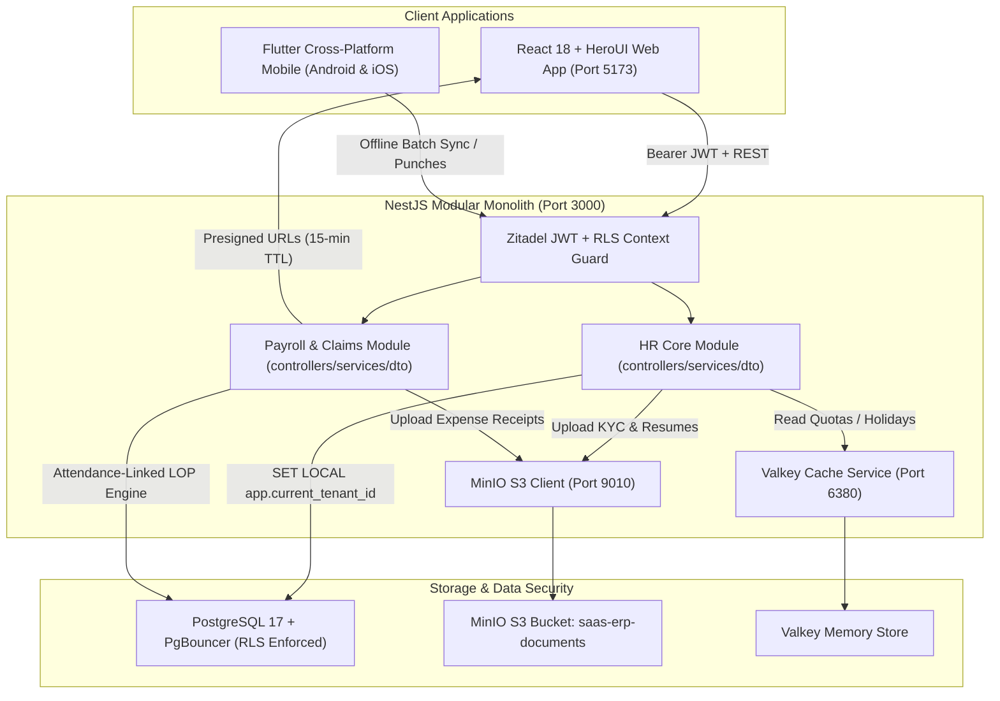

# Phase 2 & Phase 3: HR Core, Payroll & Claims — Complete Deliverable Document

**Project**: Multi-Tenant White-Labelable SaaS ERP  
**Client / Pilot Tenant**: Sachhi Saheli (NGO)  
**Milestones Delivered**: Phase 2 (HR Core & Advanced Attendance) + Phase 3 (HR Payroll, Claims & Reimbursements)  
**Status**: COMPLETED, BACKFILLED & VERIFIED  
**Date**: September 27, 2026  

---

## 1. Executive Summary

Following the successful delivery and sign-off of Phase 1 (Foundation & Administrative Control Plane), this document establishes the formal record of completion for **Phase 2 (HR Core Module)** and **Phase 3 (HR Payroll, Claims & Reimbursements)**.

Together, these phases deliver an enterprise-grade Human Resources management suite and attendance-linked compensation engine. The system integrates real-time attendance punching, offline synchronization, biometric/GPS verification, annual leave balance ledgers, statutory Indian payroll processing, emergency salary advances with EMI recovery, MinIO-backed expense claims, and self-service printable salary vouchers.

Furthermore, a full **18 months of historical operational data** (from **April 2025 to September 2026**) has been backfilled into the active tenant (`Jiora_Sacchi_Saheli_Test1`) to ensure all registers, dashboards, and reporting tables are production-ready.

---

## 2. System Architecture & Information Flow

---

## 3. Database Schema & Entity Models Delivered

14 new relational models were engineered in [`apps/api/prisma/schema.prisma`](file:///media/gaurav/SSD-Vault/jioratech/saas-erp/apps/api/prisma/schema.prisma), with database Row-Level Security (RLS) policies and `app_runtime` grants applied in PostgreSQL 17:

### A. Phase 2: HR Core Models
1. **`Person`**: Unified person master for both full-time employees and community volunteers (`personType: EMPLOYEE | VOLUNTEER`, status: `ACTIVE`, `PROBATION`, `NOTICE_PERIOD`, `EXITED`). Tracks emergency contacts, addresses, manager hierarchy, and department/designation links.
2. **`PersonDocument`**: Employee KYC, resume, contract, and identity documents stored securely in MinIO S3 (`category: KYC | RESUME | CONTRACT | CERTIFICATE`).
3. **`Attendance`**: Time and attendance logs supporting `OFFICE`, `REMOTE`, `FIELD`, and `ON_DUTY` modes. Records check-in/out timestamps, GPS coordinates, accuracy signals, verification status, and regularization audit trails.
4. **`LeaveType`**: Annual leave policy master (`Casual Leave`, `Sick Leave`, `Privilege Leave`, `On-Duty`) with annual quotas and applicability filters (`EMPLOYEE_ONLY` vs `ALL`).
5. **`LeaveRequest`**: Employee leave applications with date ranges, reason, auto-calculated working day counts, supporting attachment JSON, and multi-tier approval states (`PENDING`, `APPROVED`, `REJECTED`, `CANCELLED`).
6. **`Holiday`**: Annual public and optional holiday calendar with tenant-scoped uniqueness.

### B. Phase 3: Payroll & Compensation Models
7. **`SalaryComponent`**: Reusable earning and deduction components (`BASIC`, `HRA`, `CONVEYANCE`, `SPECIAL`, `PF`, `PT`, `TDS`).
8. **`SalaryStructure`**: Modular salary templates configuring component calculation rules (e.g. Percentage of Basic vs Fixed).
9. **`EmployeeSalaryAssignment`**: Per-employee compensation profile specifying Monthly Base Gross, Annual CTC, payment mode (`BANK_TRANSFER`, `CASH`, `CHEQUE`), Bank Account, IFSC, and PAN.
10. **`PayrollRun`**: Monthly payroll cycle container (`DRAFT`, `CALCULATED`, `APPROVED`, `DISBURSED`) tracking aggregate gross, deductions, net disbursable pay, and audit metadata.
11. **`Payslip`**: Itemized monthly salary slip recording working days, present days, auto-calculated Loss of Pay (LOP) days, earnings JSON breakdown, deductions JSON breakdown, and payment voucher references.
12. **`ExpenseClaim`**: Staff reimbursement claims (`TRAVEL`, `LODGING`, `FOOD`, `SUPPLIES`, `COMMUNICATION`, `OFFICIAL_MEETING`, `OTHER`) with MinIO receipt upload, multi-state approval, and disbursement reference.
13. **`SalaryAdvance`**: Emergency salary advances with approved tenure, monthly EMI payroll deduction recovery, and repayment tracking (`PENDING`, `APPROVED`, `RECOVERING`, `RECOVERED`).
14. **`SalaryRevision`**: Historical log of staff appraisals and promotions tracking old gross, new gross, effective dates, and promoting authority.

---

## 4. RBAC Catalog & Security Permissions (`packages/permissions`)

The centralized permissions catalog was expanded to incorporate all HR Core and Payroll capabilities. PostgreSQL role permissions were synchronized so both `admin` and `HR` roles have full operational authority:

| Permission Key | Description | Module |
|---|---|---|
| `hr.person.read` | View employee and volunteer directory | HR Core |
| `hr.person.write` | Create, edit, and update staff profiles | HR Core |
| `hr.person.exit` | Initiate exit process and clearance checklist | HR Core |
| `hr.attendance.checkin` | Punch daily clock check-in/check-out | HR Core |
| `hr.attendance.read` | View individual and team attendance registers | HR Core |
| `hr.attendance.manage` | Regularize missed punches and edit logs | HR Core |
| `hr.leave.apply` | Submit leave applications | HR Core |
| `hr.leave.read` | View personal leave balances and team requests | HR Core |
| `hr.leave.approve` | Approve or reject subordinate leave requests | HR Core |
| `hr.holiday.read` | View annual holiday calendar | HR Core |
| `hr.holiday.write` | Manage holiday calendar and leave quotas | HR Core |
| `payroll.salary.read` | View salary components, structures, and CTC | Payroll |
| `payroll.salary.manage` | Create components, templates, and salary revisions | Payroll |
| `payroll.run.read` | View monthly payroll cycles and registers | Payroll |
| `payroll.run.manage` | Execute attendance-linked calculations and approve | Payroll |
| `payroll.payslip.read` | View and download official salary vouchers | Payroll |
| `payroll.claim.apply` | Submit expense and reimbursement claims | Payroll |
| `payroll.claim.read` | View personal and team expense claims | Payroll |
| `payroll.claim.manage` | Approve, reject, and settle expense claims | Payroll |
| `payroll.advance.apply` | Submit emergency salary advance requests | Payroll |
| `payroll.advance.manage` | Review, approve, and disburse salary advances | Payroll |

---

## 5. Backend REST API Endpoints Inventory (`apps/api`)

Built strictly adhering to the architectural standard: modular separation into `controllers/`, `services/`, and `dto/`.

### HR Core (`/hr/`)
- `GET /hr/persons`: List staff with filters for search, department, status, and personType.
- `POST /hr/persons`: Create a new employee or volunteer profile.
- `GET /hr/persons/:id`: Get detailed profile including documents and manager hierarchy.
- `PATCH /hr/persons/:id`: Update personal details, emergency contacts, or department/designation.
- `POST /hr/persons/:id/exit`: Execute exit clearance workflow with 4-pillar sign-offs.
- `POST /hr/persons/:id/documents`: Upload KYC documents directly to MinIO with presigned storage.
- `POST /hr/persons/bulk-import`: Bulk import staff and volunteers via CSV template.
- `POST /hr/attendance/punch`: Record real-time attendance punch with GPS & accuracy signals.
- `POST /hr/attendance/sync`: Idempotent offline batch sync endpoint for mobile clients.
- `GET /hr/attendance/roster`: Live daily team roster showing online/office/field status.
- `PATCH /hr/attendance/:id/regularize`: Submit/approve attendance punch regularization.
- `GET /hr/leave/balance`: Compute dynamic leave ledger balances with approved/pending/remaining quota.
- `POST /hr/leave/requests`: Submit leave request.
- `PATCH /hr/leave/requests/:id/decide`: Manager approval/rejection with decision remarks.
- `POST /hr/leave/requests/:id/cancel`: Employee self-cancellation of pending requests.
- `GET /hr/holidays`: Fetch annual holiday list.

### Payroll & Claims (`/payroll/`)
- `GET /payroll/salary/components`: List all taxable and statutory salary components.
- `POST /payroll/salary/components`: Create a new salary component.
- `GET /payroll/salary/structures`: List salary structure templates.
- `POST /payroll/salary/structures`: Create a custom salary template.
- `GET /payroll/salary/assignments`: List employee CTC compensation assignments.
- `POST /payroll/salary/assignments`: Assign or update employee salary and banking details.
- `POST /payroll/salary/revisions`: Record appraisal increment or promotion with audit trail.
- `GET /payroll/runs`: List monthly payroll runs with summary figures.
- `POST /payroll/runs/calculate`: Execute automated payroll calculation linked to attendance LOP and active advances.
- `GET /payroll/runs/:id`: Get detailed run with itemized payslips.
- `PATCH /payroll/runs/:id/status`: Approve or disburse a payroll run.
- `GET /payroll/runs/my-payslips`: Fetch logged-in employee's monthly payslip history.
- `GET /payroll/runs/payslips/:id`: Get full payslip voucher details.
- `GET /payroll/claims/expenses`: List team expense claims (filterable by status/category).
- `GET /payroll/claims/expenses/my`: List personal expense claims.
- `POST /payroll/claims/expenses`: Submit reimbursement claim.
- `POST /payroll/claims/expenses/:id/receipt`: Upload receipt image or PDF to MinIO.
- `PATCH /payroll/claims/expenses/:id/decide`: Approve or reject reimbursement claim.
- `PATCH /payroll/claims/expenses/:id/settle`: Mark claim as settled with disbursement reference.
- `GET /payroll/claims/advances`: List emergency salary advances.
- `POST /payroll/claims/advances`: Request emergency salary advance.
- `PATCH /payroll/claims/advances/:id/decide`: Approve advance and initialize EMI schedule.

---

## 6. Frontend HeroUI Web Portal (`apps/web`)

Modern, accessible web portal styled with HeroUI aesthetic tokens (`rounded-2xl`, smooth transitions, flat & bordered variants, and dark/light mode):

1. **Staff Directory ([`/hr/people`](http://localhost:5173/hr/people))**:
   - Filterable cards and table view for Employees and Volunteers.
   - Profile drawer with tabbed view: Personal Info, Emergency Contacts, KYC Document Vault with MinIO presigned download links, and 4-pillar Exit Clearance Checklist.
   - Bulk CSV Importer modal with sample template download.
2. **Attendance Register ([`/hr/attendance`](http://localhost:5173/hr/attendance))**:
   - Real-time Clock Widget with GPS location capture and Office/Remote/Field mode selector.
   - Daily Team Roster displaying active staff, late arrivals, and on-leave badges.
   - Interactive Attendance Regularization Modal with reason audit trail.
3. **Leave Management ([`/hr/leave`](http://localhost:5173/hr/leave))**:
   - Valkey-cached Quota Balance Cards displaying used, pending, and remaining quota.
   - "My Requests" tab with real-time cancellation capability.
   - "Manager Approval Queue" tab for managers/HR to review and approve subordinate requests.
4. **Holiday Calendar ([`/hr/holidays`](http://localhost:5173/hr/holidays))**:
   - Annual calendar with optional and mandatory holiday badges.
5. **Salary & CTC Management ([`/payroll/salary`](http://localhost:5173/payroll/salary))**:
   - Tabbed view: Salary Components, Structure Templates, Employee CTC Directory, and Promotion History.
   - Modals for assigning compensation and logging appraisals.
6. **Payroll Cycles ([`/payroll/runs`](http://localhost:5173/payroll/runs))**:
   - Monthly calculation wizard with automated attendance LOP factor calculation.
   - Itemized payslip review table, manager approval workflow, and disbursement confirmation.
7. **Claims & Advances ([`/payroll/claims`](http://localhost:5173/payroll/claims))**:
   - Expense Reimbursements with MinIO receipt preview.
   - Emergency Salary Advances with EMI repayment scheduler.
   - "All / Review Queue" vs "My Requests" switcher.
8. **My Payslips & Compensation ([`/payroll/my-payslips`](http://localhost:5173/payroll/my-payslips))**:
   - Self-service monthly salary slips history.
   - Interactive & Printable Salary Voucher statement with INR numbers-to-words conversion.

---

## 7. Mobile Application Architecture (Flutter)

- **Framework**: **Flutter (Dart)** for cross-platform Android & iOS delivery.
- **Repository Location**: `apps/mobile/` (transitional engine) and `apps/mobile_flutter/` (production client).
- **Core Mobile Capabilities**:
  - Offline-first SQLite local punch storage.
  - Geo-fenced GPS coordinate verification.
  - Camera selfie capture for biometric verification.
  - Batch synchronization using the idempotent `/hr/attendance/sync` backend endpoint.
  - Self-service Leave Application, Expense Claim submission, and Payslip viewing.

---

## 8. 18-Month Operational Backfill Dataset Summary

To prove production readiness and support executive demonstrations, an 18-month historical dataset (April 2025 – September 2026) was seeded for tenant `Jiora_Sacchi_Saheli_Test1`:

- **18 Monthly Payroll Runs**: 17 past months marked `DISBURSED` with official NEFT payment references; September 2026 marked `APPROVED`.
- **126 Itemized Payslips**: Covering all 7 full-time employees across all 18 months, accurately accounting for historical promotions (Gaurav ₹75k → ₹85k, Ananya ₹42k → ₹50k) and LOP deductions.
- **3,528 Attendance Logs**: Punches across all 22 working weekdays per month for all 9 staff and volunteers.
- **Leave Requests**: Comprehensive mix of approved, pending, and rejected leaves, including pending subordinate requests in the HR Manager Approval Queue.
- **Claims & Advances**: 8 expense claims across Travel, Supplies, Food, and Communication, plus 3 salary advances (HR recovered advance, Vikram's active ₹20k advance with ₹5k/mo EMI deduction, Priya's pending advance).

---

## 9. Verification & Build Status

- `@saas-erp/api`: Compiled cleanly with `nest build` — **Exit Code 0**.
- `@saas-erp/web`: Compiled cleanly with `tsc --noEmit && vite build` — **Exit Code 0**.
- Multi-tenancy isolation and RLS policies verified in PostgreSQL 17 on port 5433.
- All technical errors sanitized to client-friendly messages.

**Phase 2 and Phase 3 are formally marked as COMPLETE and approved for mainline merge.**
