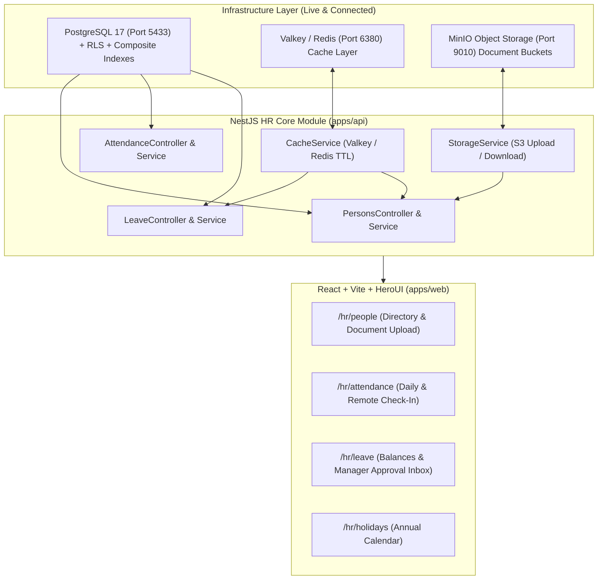
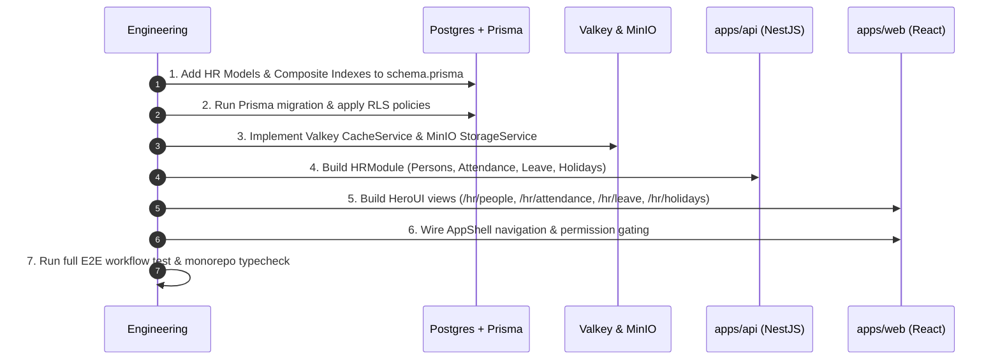

# Phase 2 (HR Core Module) — Detailed Implementation Plan

**Branch**: `phase2/hr`  
**Reference Documents**:
- `docs/deliverables/Sachhi_Saheli_Admin_HR_Module_Flow.docx`
- `docs/requirements/20260920 Sachhi Saheli (NGO) ERP Requirement (v1).docx`
- `docs/deliverables/Sachhi_Saheli_ERP_Phased_Delivery_Plan.docx`
- `docs/architecture/ARCHITECTURE.md`

---

## 1. Objectives & Scope of Phase 2

Phase 2 builds the **day-to-day people operations engine** of the ERP, connecting the organizational hierarchy established in Phase 1 (Departments, Designations, Roles) to active staff and volunteers.

### Core Deliverables:
1. **Employee vs. Volunteer Person Master** (single unified table with `personType: EMPLOYEE | VOLUNTEER`).
2. **Reporting Hierarchy** (manager-subordinate mapping for multi-tier approvals).
3. **Attendance Management** (office check-in, remote-location capture with GPS/notes, status tracking).
4. **Leave Management** (leave types like CL/OD/Business Travel, quotas, request submission, and manager approval queue).
5. **Holiday Calendar** (NGO annual holiday list).
6. **Joining & Exit Lifecycle** (joining dates, status transitions, exit checklist and record closure).
7. **Document Management via MinIO** (storing KYC, contracts, resumes, and joining documents in S3-compatible buckets).
8. **High-Performance Caching via Valkey** (caching holiday calendars, leave quotas, and organization lookups).
9. **Optimized DB Indexing** (multi-tenant composite indexes on all query filters).

---

## 2. Architecture & Tech Stack Additions

---

## 3. Database Schema, Models & Indexing Strategy

### A. Advanced PostgreSQL Indexing Plan
Every query in a multi-tenant ERP filters by `tenant_id` via Row-Level Security. We enforce composite B-Tree indexes to ensure zero sequential table scans:

| Table | Composite Index | Optimization Target |
|---|---|---|
| **`persons`** | `@@index([tenantId, personType, status])` | Filtering directory by Employee vs Volunteer and Active status |
| **`persons`** | `@@index([tenantId, departmentId])` | Department staff listing & counts |
| **`persons`** | `@@index([tenantId, designationId])` | Designation mapping & role filtering |
| **`persons`** | `@@index([tenantId, managerId])` | Immediate direct-reports lookup for reporting hierarchy |
| **`persons`** | `@@index([tenantId, email])` | Email lookup & login account linking |
| **`attendances`** | `@@unique([tenantId, personId, date])` | Enforces 1 check-in per day per person & instant date query |
| **`attendances`** | `@@index([tenantId, date, status])` | Team daily attendance dashboard & absence reports |
| **`attendances`** | `@@index([tenantId, personId, checkInTime])` | Monthly attendance history per staff member |
| **`leave_requests`** | `@@index([tenantId, approverId, status])` | **Manager Approval Queue** (high frequency query) |
| **`leave_requests`** | `@@index([tenantId, personId, status])` | User's active leave requests and balance calculation |
| **`leave_requests`** | `@@index([tenantId, startDate, endDate])` | Overlap validation & calendar view |
| **`leave_types`** | `@@index([tenantId, isActive])` | Fast lookup of active leave types |
| **`holidays`** | `@@index([tenantId, date])` | Annual holiday queries and calendar lookups |
| **`person_documents`** | `@@index([tenantId, personId, category])` | Employee document listing (KYC, Resume, Letters) |

### B. New Database Models (`apps/api/prisma/schema.prisma`)
1. **`Person`**:
   - `id`, `tenantId`, `userId` (optional link to login user)
   - `personType`: Enum `EMPLOYEE` | `VOLUNTEER`
   - `status`: Enum `JOINED` | `PROBATION` | `ACTIVE` | `NOTICE_PERIOD` | `EXITED`
   - `firstName`, `lastName`, `email`, `phone`, `gender`, `dob`, `address`, `emergencyContact`
   - `departmentId`, `designationId`
   - `managerId` (self-relation for hierarchy)
   - `joiningDate`, `confirmationDate`, `exitDate`, `exitReason`
2. **`PersonDocument`**:
   - `id`, `tenantId`, `personId`
   - `name`, `fileKey` (MinIO S3 object path), `mimeType`, `sizeBytes`
   - `category`: Enum `KYC` | `RESUME` | `JOINING_LETTER` | `OTHER`
   - `uploadedAt`
3. **`Attendance`**:
   - `id`, `tenantId`, `personId`, `date`
   - `checkInTime`, `checkOutTime`
   - `mode`: Enum `OFFICE` | `REMOTE` | `FIELD` | `ON_DUTY`
   - `latitude`, `longitude`, `locationName`, `notes`
   - `status`: Enum `PRESENT` | `HALF_DAY` | `ABSENT` | `ON_LEAVE`
4. **`LeaveType`**:
   - `id`, `tenantId`, `name`, `code` (`CL`, `OD`, `BT`), `annualQuota`, `applicableTo` (`EMPLOYEE_ONLY` | `ALL`)
5. **`LeaveRequest`**:
   - `id`, `tenantId`, `personId`, `leaveTypeId`
   - `startDate`, `endDate`, `daysCount`, `reason`
   - `status`: Enum `PENDING` | `APPROVED` | `REJECTED` | `CANCELLED`
   - `approverId`, `decisionNotes`, `decidedAt`
6. **`Holiday`**:
   - `id`, `tenantId`, `name`, `date`, `isOptional`

---

## 4. Caching & Storage Implementation Details

### A. Valkey Caching Layer (`redis://localhost:6380`)
- **Package**: `ioredis` wrapped in a NestJS `CacheService`.
- **Cached Data & Invalidation Strategy**:
  - `tenant:{tenantId}:leave_types` — Cached with 1-hour TTL, invalidated on `createLeaveType` or quota edit.
  - `tenant:{tenantId}:holidays:{year}` — Cached with 2-hour TTL, invalidated on `addHoliday`.
  - `tenant:{tenantId}:org_structure` — Cached department/designation lookup lists (30-minute TTL).
  - Cache bypass / refresh capability on demand.

### B. MinIO Document Object Storage (`localhost:9010`)
- **Package**: `@aws-sdk/client-s3` and `@aws-sdk/s3-request-presigner`.
- **Bucket**: `saas-erp-documents` (automatically verified/created on API startup).
- **Key Partitioning**:
  `tenants/{tenantId}/persons/{personId}/{category}/{timestamp}-{cleanFileName}`
- **Security & Validation**:
  - MIME-type whitelist: `application/pdf`, `image/jpeg`, `image/png`.
  - Max file size limit: `5 MB`.
  - Presigned GET URLs generated with 15-minute expiry so direct S3 URLs are never permanently exposed to the public.

---

## 5. Granular Permissions (`packages/permissions`)

| Permission Key | Description | Module |
|---|---|---|
| `hr.person.read` | View employee & volunteer directory | HR |
| `hr.person.write` | Create/edit profiles & upload documents | HR |
| `hr.person.exit` | Process exit workflow and closures | HR |
| `hr.attendance.checkin` | Submit daily & remote check-in / check-out | HR |
| `hr.attendance.read` | View attendance logs (self / team / org) | HR |
| `hr.attendance.manage` | Regularize or modify attendance logs | HR |
| `hr.leave.apply` | Apply for leaves | HR |
| `hr.leave.read` | View leave balances & request status | HR |
| `hr.leave.approve` | Approve/reject subordinate leave requests | HR |
| `hr.holiday.read` | View holiday calendar | HR |
| `hr.holiday.write` | Create holidays & configure leave types | HR |

---

## 6. Frontend HeroUI Views (`apps/web/src/routes/hr/`)

1. **Person Directory (`/hr/people`)**:
   - Filter pills (`All`, `Employees`, `Volunteers`, `Active`, `Exited`).
   - HeroUI `<User>` compound cards with status dots and department chips.
   - "New Person" modal with Person Type selector (`Employee` vs `Volunteer`).
   - Person Detail Drawer: Contact details, reporting manager, and document upload/download list.
2. **Attendance Desk (`/hr/attendance`)**:
   - Quick interactive Check-in / Check-out widget.
   - Mode switcher (`Office`, `Remote`, `Field`) with location text/GPS button and notes.
   - Monthly attendance calendar table with status chips.
   - Team attendance summary tab for managers.
3. **Leave Portal & Approvals (`/hr/leave`)**:
   - Quota cards (Casual Leave `CL`, On-Duty `OD`, Business Travel `BT`).
   - "Apply for Leave" modal with date picker and automatic working-days calculation.
   - "My Requests" tab.
   - **"Manager Approval Queue" tab**: One-click Approve/Reject actions with feedback notes.
4. **Holiday Calendar (`/hr/holidays`)**:
   - Annual calendar view displaying national, state, and NGO-specific holidays.
5. **Sidebar Navigation Integration**:
   - Dynamic `HR Core` section in `AppShell.tsx` visible to users holding `hr.*` permissions.

---

## 7. Execution Sequence

---

## 8. Immediate Next Step

With your approval, we will proceed with:
- **Step 1**: Install `ioredis` and `@aws-sdk/client-s3` in `apps/api`.
- **Step 2**: Add the new models, relations, and composite indexes to `apps/api/prisma/schema.prisma` and execute the migration with RLS.
